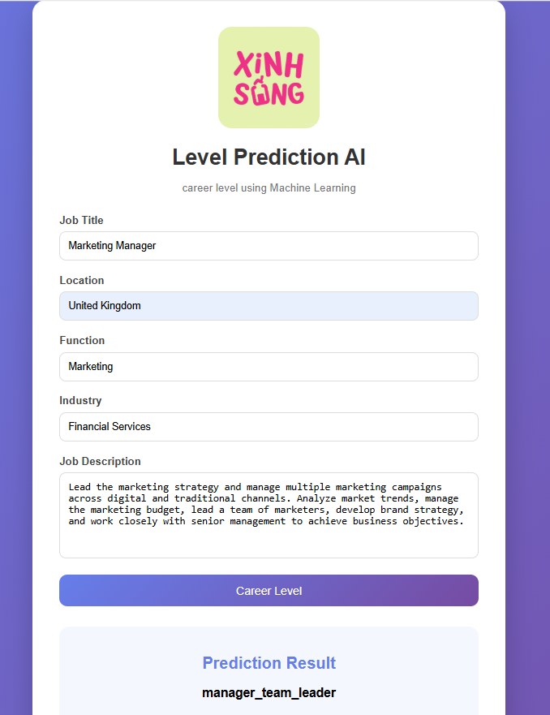
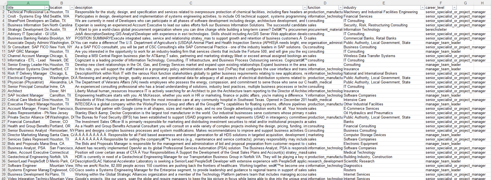

# Career Prediction System

An AI-powered web application that predicts the career level of a job posting based on job information such as title, location, description, function, and industry.

## Live Demo

## Live Demo

Web Application:  
https://career-prediction-web.vercel.app

FastAPI Backend:  
https://ml-service-omega.vercel.app

Swagger API Documentation:  
https://ml-service-omega.vercel.app/docs

## Preview


## Dataset

This project was developed using a real-world company dataset containing job posting information.

The dataset was used as the primary source for training and evaluating the career-level prediction model. It contains structured and unstructured job-related features, allowing the project to demonstrate how real-world data can be prepared and transformed into machine-learning features.

The main fields used in the project include:

```text
title
location
description
function
industry
career_level
```

The dataset combines both textual and categorical information. Text fields require feature extraction before they can be used by the machine learning model, while categorical fields require appropriate encoding.

### Real Dataset Preview

The following image shows a sample of the actual dataset structure used during development:



The original dataset is not fully published in this repository because it contains company data. The preview is provided to demonstrate the structure and characteristics of the real-world data used in the project.
## How It Works

The system consists of three main components:

1. **Web Application** — Provides the user interface for entering job information.
2. **FastAPI ML Service** — Receives the job information and sends it to the trained machine learning model.
3. **Machine Learning Model** — Processes the input data and predicts the career level.

The overall workflow is:

```text
User
 │
 ▼
Web Application
Express + TypeScript + Pug
 │
 │ HTTP POST /predict
 ▼
FastAPI
Machine Learning API
 │
 ▼
Scikit-learn Pipeline
 │
 ├── TF-IDF
 ├── One-Hot Encoding
 ├── Feature Selection
 └── Random Forest
 │
 ▼
Career Level Prediction
```

### Input

The application accepts five job-related fields:

```text
Job Title
Location
Job Description
Function
Industry
```

These values are sent from the web application to the FastAPI prediction service.

---

## Project Structure

```text
CareerPredictionSystem/
│
├── data/
│   └── final_project.ods
│
├── training/
│   └── train_model.py
│
├── models/
│   └── career_level_model.pkl
│
├── ml_service/
│   ├── app.py
│   └── test_api.py
│
├── web_app/
│   ├── public/
│   │   ├── logo.png
│   │   ├── demo.png
│   │   └── style.css
│   │
│   ├── src/
│   │   └── server.ts
│   │
│   ├── views/
│   │   └── index.pug
│   │
│   ├── package.json
│   └── package-lock.json
│
├── .gitignore
└── README.md
```

### `data/`

Contains the dataset used to train the machine learning model.

```text
data/
└── final_project.ods
```

### `training/`

Contains the machine learning training script.

```text
training/
└── train_model.py
```

The training script loads the dataset, preprocesses the features, performs hyperparameter optimization, evaluates the model, and saves the trained model.

### `models/`

Contains the trained machine learning model used by the prediction service.

```text
models/
└── career_level_model.pkl
```

The model is loaded when the FastAPI service starts. The application does not retrain the model every time a user makes a prediction.

### `ml_service/`

Contains the machine learning API built with FastAPI.

```text
ml_service/
├── app.py
└── test_api.py
```

`app.py` loads the trained model and provides the prediction endpoint.

`test_api.py` is used to test the prediction API.

### `web_app/`

Contains the user-facing web application built with Express.js, TypeScript, and Pug.

```text
web_app/
├── public/
├── src/
└── views/
```

`public/` contains static assets such as the logo, demo screenshot, and CSS.

`src/` contains the TypeScript server code.

`views/` contains the Pug templates used to render the web interface.

---

## Machine Learning Model

The model predicts the career level of a job posting using five input features:

```text
title
location
description
function
industry
```

Different preprocessing methods are used depending on the type of feature.

### Text Processing

TF-IDF is used to transform text-based features into numerical representations.

The text-based features include:

```text
title
description
industry
```

### Categorical Processing

One-Hot Encoding is used for categorical features:

```text
location
function
```

The encoder is configured with:

```python
handle_unknown="ignore"
```

This allows the application to handle previously unseen categories during prediction without causing an encoding error.

### Feature Selection

Feature selection is applied after preprocessing to reduce the number of features passed to the classifier.

### Classification

The final classifier is:

```text
Random Forest Classifier
```

The complete machine learning pipeline is:

```text
Raw Job Data
     │
     ▼
ColumnTransformer
     │
     ├── title → TF-IDF
     ├── location → One-Hot Encoding
     ├── description → TF-IDF
     ├── function → One-Hot Encoding
     └── industry → TF-IDF
     │
     ▼
Feature Selection
     │
     ▼
Random Forest Classifier
     │
     ▼
Career Level
```

---

## Model Optimization

The project uses `RandomizedSearchCV` to search for suitable hyperparameters for the Random Forest classifier.

The current configuration includes:

```text
RandomizedSearchCV
n_iter = 20
cv = 3
scoring = precision_macro
```

The best-performing configuration from the search is used to create the final trained model.

The trained model is saved as:

```text
models/career_level_model.pkl
```

---

## API

The machine learning service provides an API for career-level prediction.

### Health Check

```http
GET /
```

Example response:

```json
{
    "message": "Career prediction API is running"
}
```

### Career Prediction

```http
POST /predict
```

Example request:

```json
{
    "title": "Software Engineer",
    "location": "Berlin",
    "description": "Develop and maintain software applications.",
    "function": "Information Technology",
    "industry": "Technology"
}
```

Example response:

```json
{
    "career_level": "senior_specialist_or_project_manager"
}
```

The prediction depends on the input data and the trained machine learning model.

---

## Technology Stack

### Machine Learning

- Python
- Pandas
- Scikit-learn
- Joblib
- NumPy
- SciPy

### Machine Learning API

- FastAPI
- Pydantic
- Uvicorn

### Web Application

- Node.js
- Express.js
- TypeScript
- Pug

---

## Running the Project Locally

The project requires two services to run:

```text
FastAPI ML Service
        +
Express Web Application
```

### 1. Start the ML Service

Open a terminal and navigate to:

```bash
cd ml_service
```

Create a virtual environment:

```bash
python -m venv venv
```

Activate the environment on Windows:

```powershell
venv\Scripts\activate
```

Install the required Python packages:

```bash
pip install pandas scikit-learn joblib fastapi uvicorn
```

Start FastAPI:

```bash
uvicorn app:app --reload
```

The ML API will run at:

```text
http://127.0.0.1:8000
```

### 2. Start the Web Application

Open another terminal and navigate to:

```bash
cd web_app
```

Install the Node.js dependencies:

```bash
npm install
```

Start the web application:

```bash
npm start
```

The web application will run at:

```text
http://localhost:3000
```

Open the address in a browser to use the application.

---

## Testing the API

The project includes:

```text
ml_service/test_api.py
```

With the FastAPI service running, open another terminal:

```bash
cd ml_service
```

Activate the virtual environment:

```powershell
venv\Scripts\activate
```

Run:

```bash
python test_api.py
```

A successful request returns a career-level prediction from the trained model.

---

## Model Training

To retrain the model, use:

```text
training/train_model.py
```

The training dataset is located at:

```text
data/final_project.ods
```

The training workflow is:

```text
Dataset
   │
   ▼
Data Preprocessing
   │
   ▼
Feature Preparation
   │
   ▼
Train/Test Split
   │
   ▼
Feature Transformation
   │
   ▼
Feature Selection
   │
   ▼
Random Forest
   │
   ▼
RandomizedSearchCV
   │
   ▼
Model Evaluation
   │
   ▼
career_level_model.pkl
```

After retraining, the new model is saved to:

```text
models/career_level_model.pkl
```

The FastAPI service must be restarted after replacing the model so that the new model is loaded.

---

## Application Workflow

The complete application workflow is:

```text
User enters job information
          │
          ▼
Express Web Application
          │
          ▼
POST /predict
          │
          ▼
FastAPI ML Service
          │
          ▼
Preprocessing Pipeline
          │
          ▼
Random Forest Model
          │
          ▼
Career Level Prediction
          │
          ▼
FastAPI Response
          │
          ▼
Web Application
          │
          ▼
Prediction displayed to user
```

---

## Project Purpose

This project demonstrates how a machine learning classification model can be integrated into a full-stack web application.

Instead of running the machine learning model directly inside the web application, the project separates the prediction service from the user interface. This makes the architecture easier to develop, test, and deploy independently.

---

## Future Improvements

Possible improvements include:

- Adding prediction confidence scores
- Improving model performance
- Comparing multiple machine learning algorithms
- Adding automated testing
- Improving API validation
- Adding authentication
- Adding model monitoring
- Automating model retraining
- Improving the user interface
- Deploying the complete system to production
